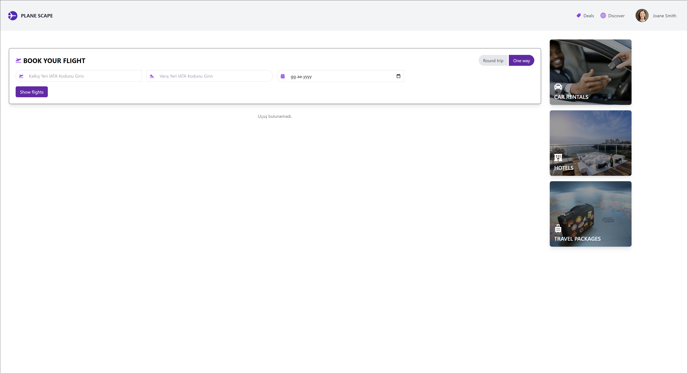
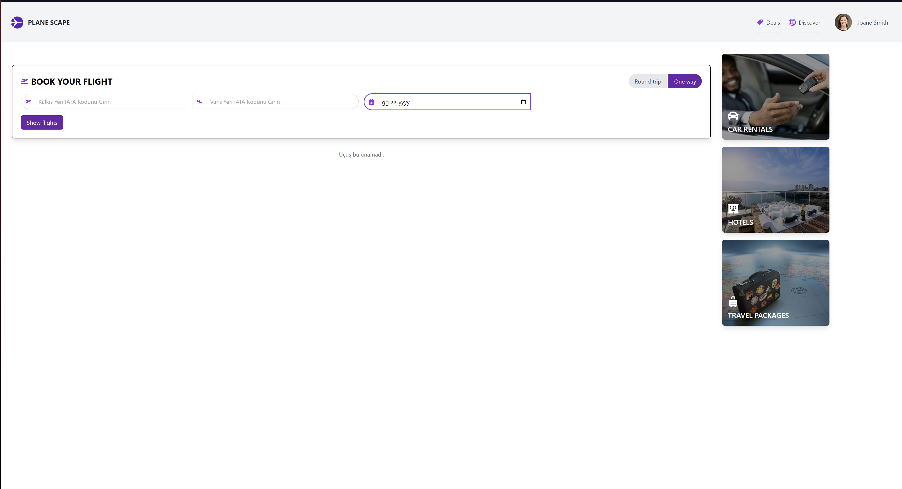
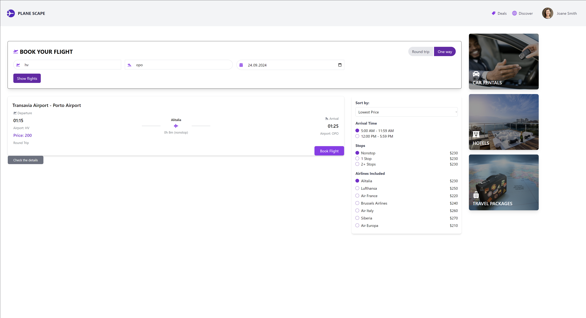
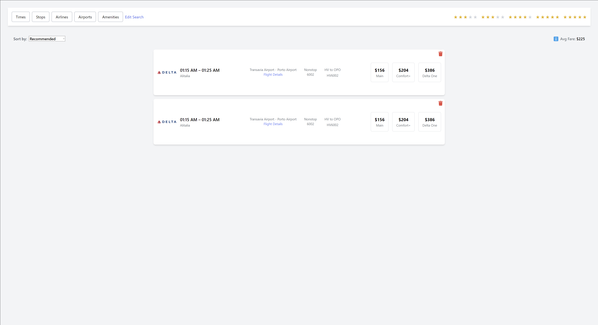
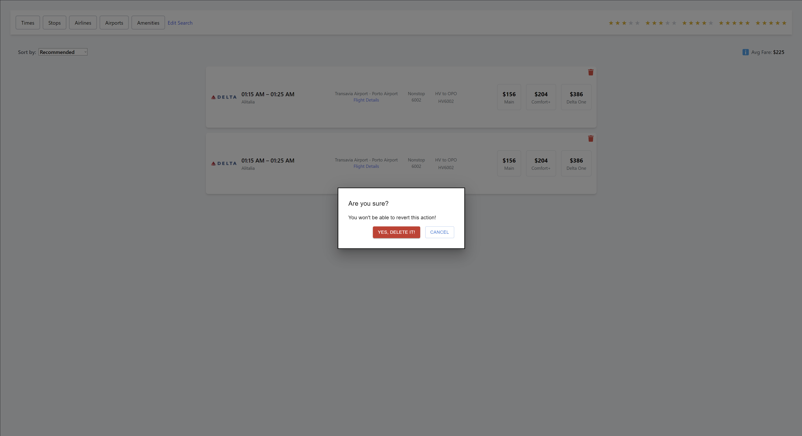

# Flight-Reservation-App

## 🚀 Kullanılan Teknolojiler

Bu projede MERN (MongoDB, Express.js, React.js, Node.js) teknolojileri kullanılarak Schipol Havalimanına ait API kullanılarak uçuşlar listelenmektedir.
Estetik ve kullanıcı dostu bir arayüz oluşturmak için Tailwind CSS, React-Icons kullanılmıştır.
IATA ve Airlines kodlarına yönelik format işlemleri için çeşitli JSON türü data/airlines.json dosasından yararlanılmıştır. API'nin düzgün çalıştığını test etmek için Postman kullanılmıştır.

## 🚀 Proje Açıklaması

Uygulama içinde uçuşlar, API tarafından sağlanan IATA kodları ile sunucu üzerinden yapılan istek sonucu tarih ve yön bilgilerine göre filtrelenmektedir. Filtrelenen bu uçuşlar, varış noktalarının IATA kodlarına göre listelenir. Listelenen uçuşlar, havaalanlarının IATA kodları havaalanı isimlerine dönüştürülerek uçuş kartı bileşenine eklenir. Uçuş kartında kalkış ve varış saatleri, uçuş süresi, havayolu şirketi, havaalanı adı ve IATA kodu gibi bilgiler yer alır. Uçuşa dair detaylar da görüntülenebilir. Ek filtreleme seçenekleri arasında, uçuşların havayolu şirketlerine göre filtrelenmesi de mümkündür. Sayfa üzerinde hareketli ikonlar ve yüklenme animasyonları bulunmaktadır. Uçuş kartında yer alan "Book Flight" butonu, kullanıcıyı "Uçuşlarım" sayfasına yönlendirir ve seçilen uçuş, veri tabanına kaydedilir. "Uçuşlarım" sayfasında, veri tabanından alınan kullanıcıya ait tüm uçuşlar listelenir ve her bir uçuş kartında uçuş bilgileri ile detayları gösterilir. Kullanıcı, uçuşları isteğine bağlı olarak silebilir ve bu işlem sonucunda ilgili uçuş veri tabanından kaldırılır.

## Resim Galerisi

Aşağıda projede kullanılan 7 resmi görebilirsiniz:

|  |  |  |  |
| ------------------ | ------------------ | ------------------ | ------------------ |
|  |  |  |

## 🚀 Proje Kurulumu ve Çalıştırma

## 🚀 Proje Kurulumu ve Çalıştırma

1. **Projeyi İndirme:**

   - Repositoriyi bilgisayarınıza klonlayın:

     git clone https://github.com/kullanici-adiniz/Flight-Reservation-App.git

     ```

     ```

   - Proje dizinine girin:

     cd Flight-Reservation-App

     ```

     ```

2. **Client ve Server Kurulumu:**

   - `client` dizinine gidin:
     ```bash
     cd client
     ```
   - Gerekli bağımlılıkları yükleyin:
     ```bash
     npm install
     ```
   - `server` dizinine gidin:
     ```bash
     cd.. sonra cd server
     ```
   - Gerekli bağımlılıkları yükleyin:
     ```bash
     npm install
     ```

3. **Uygulamayı Başlatma:**
   - **Client** uygulamasını başlatın:

     ```bash
     npm run dev
     ```

   - **Server** uygulamasını başlatın:
     ```bash
     node server.js
     ```
